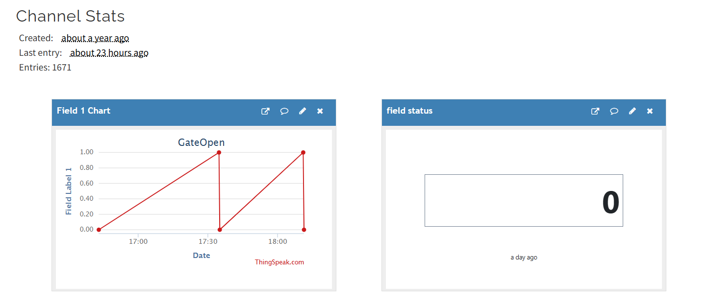

# ESP8266 Relay Control with MIT App Inventor & ThingSpeak
## Project Overview
This project allows users to remotely control a relay connected to an ESP8266 module using a custom-built MIT App Inventor Android app. The ESP8266 communicates with ThingSpeak, where it reads a field value to trigger the relay. The Android app updates the ThingSpeak field, enabling wireless relay activation.
## Features

- ✅ **Remote Relay Control**: Toggle the relay ON/OFF from anywhere using an Android app.
- ✅ **WiFi-Based Communication**: Uses ESP8266 to connect to the internet.
- ✅ **Cloud Integration**: ThingSpeak acts as a bridge between the app and the ESP8266.
- ✅ **Feedback Mechanism**: The ESP8266 reads the ThingSpeak field value and updates the relay accordingly.

## Components & Requirements
### Hardware Components

- ESP8266 (NodeMCU) WiFi Module
- Relay Module (5V or 3.3V compatible)
- Power Supply (5V/2A for ESP8266 & Relay)
- Connecting Wires
- 
### Software & Platforms

- MIT App Inventor (for building the Android app)
- Arduino IDE (for programming the ESP8266)
- ThingSpeak (for cloud-based communication)

## Setup & Configuration
### 1 Create a ThingSpeak Channel

1. Go to [ThingSpeak](https://thingspeak.com) and sign in.
2. Click "New Channel" and create a field (Field 1) to store relay control data.
3. Note the Channel ID, Read API Key, and Write API Key.

### 2 Flash ESP8266 with Arduino Code

1. Install the ESP8266 board package in the Arduino IDE.
2. Install the ThingSpeak and ESP8266WiFi libraries.
3. Upload the following Arduino Sketch to your ESP8266:
### 3 Replace with your WiFi Credentials
```cpp
const char* SSID = "Your_WiFi_Name";  
const char* PASSWORD = "Your_WiFi_Password";  
```
### 4 Replace with your ThingSpeak API Keys
```cpp
const char* READ_API_KEY = "READ_API_KEY";  
const char* WRITE_API_KEY = "WRITE_API_KEY";   
```
### 5 Build the Android App with MIT App Inventor
1. Open MIT App Inventor and create a new project.
2. Add the following UI components:
3. Button: To turn the relay ON/OFF.
4. Label: To display status messages.
5. Web Component: To send HTTP requests to ThingSpeak.
6. Use the Web Component to send a request to ThingSpeak:
7. ON Button: https://api.thingspeak.com/update?api_key=YOUR_WRITE_API_KEY&field1=1
8. OFF Button: https://api.thingspeak.com/update?api_key=YOUR_WRITE_API_KEY&field1=0
9. Test the app on your phone and deploy it.
## How It Works
1. The user presses the ON button in the Android app.
2. The app sends a request to ThingSpeak, updating Field 1 to 1.
3. The ESP8266 reads this field and triggers the relay.
4. The ESP8266 then resets the field back to 0, ensuring the relay is ready for the next command.
